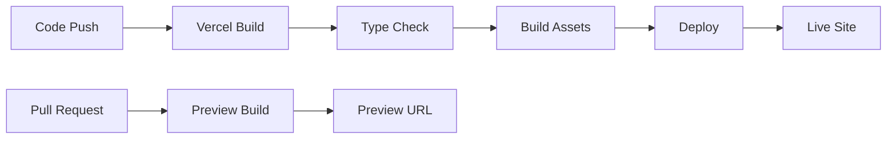

# STUDYTOMY

## Table of Contents
- [About STUDYTOMY](#about-studytomy)
- [Build Pipeline](#build-pipeline)
- [Features](#features)
- [Contact Information](#contact-information)

## Build Pipeline

[](https://vercel.com)
[](https://github.com)
[](https://reactjs.org)
[](https://www.typescriptlang.org)

### Deployment Pipeline

Our application uses **Vercel** for continuous deployment with the following automated pipeline:

#### 🚀 **Production Deployment**
```bash
# Automatic deployment on main branch
git push origin main
```

#### 🔧 **Build Process**
1. **Install Dependencies**
   ```bash
   bun install
   ```

2. **Type Checking**
   ```bash
   bun run lint
   ```

3. **Build Application**
   ```bash
   bun run build
   ```

4. **Deploy to Vercel**
   - Automatic deployment on push to `main`
   - Preview deployments for pull requests
   - Environment variables configured in Vercel dashboard

#### 📊 **Build Configuration**

**Vercel Settings:**
- **Framework Preset**: Next.js
- **Build Command**: `bun run build`
- **Output Directory**: `out` (Static Export)
- **Install Command**: `bun install`
- **Runtime**: Bun 1.x or Node 18.x

**Environment Variables:**
```bash
# Production
NEXT_PUBLIC_SUPABASE_URL=your_supabase_url
NEXT_PUBLIC_SUPABASE_ANON_KEY=your_supabase_key
NEXT_PUBLIC_GTM_ID=your_gtm_id
NEXT_PUBLIC_SITE_URL=https://studytomy.com
```

#### 🔄 **Deployment Workflow**



#### 📈 **Performance Optimizations**
- **Code Splitting**: Automatic route-based splitting
- **Image Optimization**: Next.js Image component (unoptimized for static export)
- **Preloading**: Background component preloading
- **Caching**: Intelligent browser caching strategies
- **Compression**: Gzip compression enabled

#### 🛠️ **Local Development**
```bash
# Start development server
bun run dev

# Build for production
bun run build

# Start production server
bun run start
```

#### 🔍 **Build Monitoring**
- **Build Time**: ~1-2 minutes
- **Bundle Size**: Optimized with code splitting
- **Lighthouse Score**: 90+ performance
- **Core Web Vitals**: Optimized

---

## About STUDYTOMY
STUDYTOMY is an innovative online tutoring platform designed to provide high-quality, personalized education to students around the world. Our mission is to make learning accessible, engaging, and effective for all students, regardless of their location or background.

### Objectives
- **Accessibility**: Ensure that every student has access to quality education, no matter where they are.
- **Personalization**: Tailor learning experiences to meet the unique needs and goals of each student.
- **Engagement**: Create an interactive and engaging learning environment that motivates students to achieve their best.
- **Excellence**: Maintain high standards of teaching and learning through continuous improvement and innovation.

## Features
- **Expert Tutors**: Our tutors are highly qualified professionals with extensive teaching experience and subject expertise.
- **1-on-1 Online Tutoring**: Personalized one-on-one sessions that cater to the individual needs of each student.
- **Flexible Scheduling**: Convenient scheduling options that allow students to book sessions at times that work best for them.
- **Comprehensive Study Materials**: Access to a wide range of study materials, including past papers, practice tests, and revision resources.
- **Secure Platform**: A safe and secure online environment that protects the privacy and data of our students.
- **Global Reach**: Connect with tutors and students from around the world, breaking geographical barriers.

## Contact Information
- **Phone**: +61 461 367 702
- **Email**: info@studytomy.com
- **Location**: Melbourne, Australia
